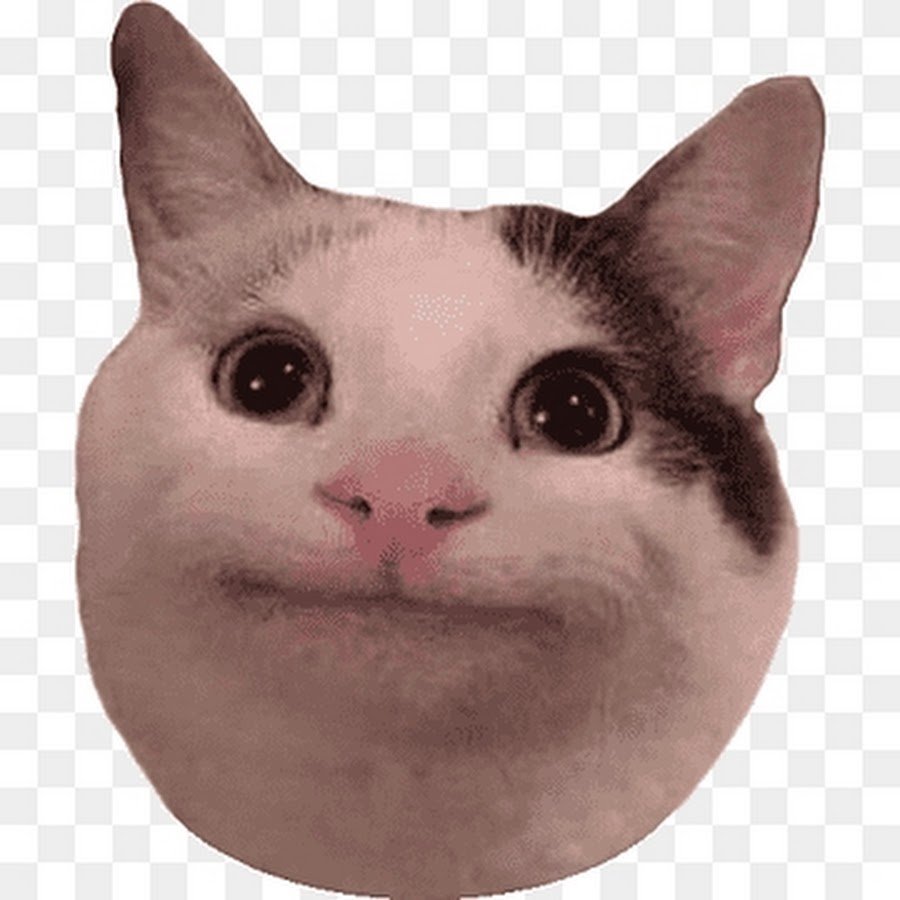

# Инструкция для работы с маркдаун

## Выделение текста 
Что бы выделить текст курсивом необходимо обрантьь его зездочками (*) Или знаком нижнего подчеркивание (_). Например, *вот так*. 
Например _вот так_

Что бы выд.елить текст полужирным, необходимо обрамить его двойными звездачками (**) или двойным знаком нижнего подчеркивание (__).
 Например **вот так**.
Например __вот так__.

Альтернативные способы выделение текста жирным или курсивом нужны для того, что бы мы могли совмещать оба этих способа. Например, _текст можеть быть выделеным курсивом и при этом быть **полужирным**_. 

## Списки 

## Работа с изображением 

Что бы вставить изображение в текст, достаточно написать следующие: 

## Ссылку 

## Работа с таблицами

## Цитаты 

## Заключение 